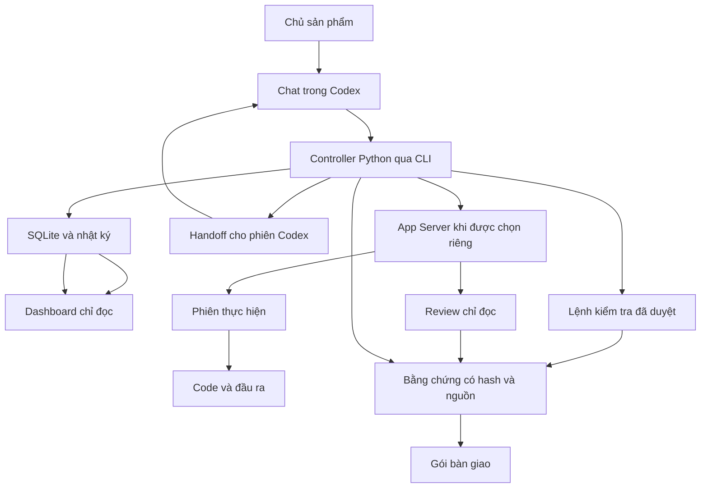

# Kiến trúc và ranh giới

Python 3.9+, thư viện chuẩn, SQLite WAL, HTTP cục bộ. Codex dùng đăng nhập sẵn có; quyền dùng model phụ thuộc tài khoản. Không cần database service hoặc khóa OpenAI API riêng cho adapter này.

`PRODUCT_CYCLE_HOME` mặc định `~/.local/share/product-cycle`. State riêng cho absolute project path nằm trong thư mục có hash. SQLite, brief, config và evidence objects nằm ngoài project; Codex workspace-write chỉ được ghi project. Work artifacts ở `<project>/.product-cycle/artifacts/<task>/r<revision>/a<attempt>/`. Không đặt state home trong project.

Không sửa cấu hình Codex toàn cục. App Server truyền model, effort, cwd, policy, sandbox từng phiên. Native handoff ghi cấu hình yêu cầu; phiên Codex chọn model/effort qua khả năng của host khi có, không tự nhận yêu cầu là cấu hình đã áp dụng. Model/effort app-server trả lại và sự kiện rerouting được ghi riêng với cấu hình yêu cầu. Token chưa có số liệu không phải 0; ngân sách token phụ thuộc sự kiện có thể đến trễ. Timeout và số lần thử được giới hạn ở controller.

Lock OS ngăn hai controller đồng thời. Controller chạy tuần tự dù backlog hỗ trợ DAG; không tự tạo worktree. Review dùng phiên mới read-only. Crash: recover → kiểm tra thay đổi → reopen, không tự lặp thao tác chưa rõ kết quả.

Lệnh kiểm tra là argv đã duyệt trong plan; kiểm tra kết nối dịch vụ được khai báo trong thiết kế kỹ thuật và liên kết qua plan; controller chạy cục bộ ngoài sandbox Codex. Dùng lệnh tin cậy của repository được chọn. Không publish/deploy/merge là policy trong hướng dẫn và không có endpoint triển khai; gói không phải môi trường cách ly tuyệt đối cho code không tin cậy.

Dashboard bind 127.0.0.1 và chỉ đọc mặc định cho cycle mới. POST bị từ chối khi dashboard_read_only=true. Cycle cũ còn điều khiển phải kiểm tra Host, token và same-origin. Chỉ phục vụ bằng chứng đã đăng ký và đúng hash. HTML/SVG hiển thị như văn bản, không chạy trong dashboard.

Jev là adapter tùy chọn cho câu hỏi ngữ nghĩa trên nội dung người dùng cung cấp rõ ràng. Không tự gửi source, secrets, dữ liệu cá nhân hoặc tài liệu riêng tư. Nhận định Jev không thay kết quả chạy kiểm thử.
