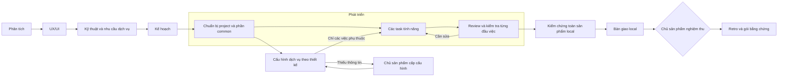

# Quy trình Product Cycle

Chuẩn bị repository bằng Git, hướng dẫn chung và skill trước phân tích. Sau thiết kế/plan, thiết lập cấu trúc, runtime, coding rules, công cụ kiểm tra và phần dùng chung trước tính năng. Phát triển từng phần sản phẩm sử dụng được, truy vết từ yêu cầu tới bàn giao, cải thiện dựa trên bằng chứng.

Mọi công việc có phiên thực hiện và review riêng. Sơ đồ nhấn mạnh review phát triển để dễ đọc. Dự án mới có quyết định chủ sản phẩm tại phân tích, UX/UI, mốc dùng thử trải nghiệm cốt lõi và handoff; mỗi bước trước đó vẫn cần review độc lập. Cấu hình thật chỉ bắt đầu sau khi phân tích, thiết kế và plan đã hoàn tất review. Thiếu một dịch vụ không chặn các việc không phụ thuộc. VPS và phát hành ra ngoài được ghi là để sau, không phải điều kiện hoàn tất bản local. Dự án cũ giữ gate riêng.

## Phân cấp trên dashboard

Giữ 9 bước lớn. Bên trong Phát triển có phần chuẩn bị project/common, sau đó là các đầu việc tính năng trong plan. Mỗi công việc chứa các bước nhỏ với trạng thái và bằng chứng riêng. Chuẩn bị project/common là công việc coding thông thường, không phải một giai đoạn sản phẩm mới.

- Chuẩn bị: đọc thiết kế và coding rules → cấu trúc/runtime → công cụ kiểm tra → phần dùng chung cần thiết → kiểm tra và review.
- Từng tính năng: đọc phạm vi → thực hiện → kiểm tra → review → xác nhận kết quả.

Git, hướng dẫn chung và skill được chuẩn bị lúc init. Coding rules cụ thể theo stack được chốt sau thiết kế kỹ thuật và kế hoạch; không tạo common component chưa cần dùng.

## Kết quả và truy vết

Phân tích và thiết kế đủ cho phiên bản đầu hoặc đợt phát triển hiện tại; không chờ mô tả hoàn hảo toàn bộ sản phẩm. Chia việc thành các phần chạy được từ giao diện tới dữ liệu, kiểm tra từng phần và cập nhật kế hoạch khi có bằng chứng mới. Nếu thay đổi ảnh hưởng thiết kế hoặc dịch vụ, mở lại bước liên quan để review lại trước khi thực thi phụ thuộc.

Quy mô đầu ra phù hợp độ khó. Thay đổi nhỏ có thể có thiết kế ngắn và một kiểm tra tập trung. Vấn đề thay đổi mục tiêu, dữ liệu quan trọng hoặc trải nghiệm phải được ghi nhận, không suy đoán rồi coi là dữ kiện.

Yêu cầu R → thiết kế/kiến trúc → task T → artifact/bằng chứng E → tiêu chí C → quyết định → manifest. Mở lại công việc tạo revision mới, đánh dấu phụ thuộc cần xem lại và giữ các phiên cũ.

## Trạng thái

`pending` → `running` → `reviewing` → `done` hoặc `awaiting_approval`.

Review có thể trả `rework`/`blocked`. `reopen` tạo `stale`. Công việc bị loại khỏi kế hoạch mới là `superseded`, giữ lịch sử. `pause` dừng ở ranh giới công việc; `recover` xử lý phiên gián đoạn khi lock đã được giải phóng.

## Nghiệm thu

Controller kiểm tra cấu trúc, đầu ra, phụ thuộc, hash bằng chứng, exit code lệnh đã duyệt và fingerprint nguồn. Reviewer đánh giá ngữ nghĩa. Chủ sản phẩm quyết định các gate. Một file tồn tại hoặc AI đồng ý không đủ chứng minh hành vi sản phẩm.

Nghiệm thu UI dùng quan sát trình duyệt thật do operator ghi nhận: ảnh, URL, kịch bản, yêu cầu, người quan sát, fingerprint. Codex không tự khai bằng chứng browser. Adapter tự động browser cần được bổ sung và kiểm chứng riêng.

## Cải thiện

Retro giữ quan sát và đề xuất. Cải thiện cần bằng chứng cùng input/expected cho eval. Không tự thay quy trình đang chạy. Phản hồi sau sử dụng được đưa vào brief vòng sau khi có dữ liệu; gói chưa tự theo dõi production.

## Theo dõi đầu việc và dịch vụ

Plan có bao nhiêu đầu việc, dashboard hiển thị đủ bấy nhiêu từ lúc có đầu ra dự kiến. Trạng thái thực thi chỉ bắt đầu khi plan được review/chấp nhận theo cấu hình. Mỗi dòng cho xem bước hiện tại, phụ thuộc chưa xong, tiêu chí đã đạt và bằng chứng. Đã kiểm chứng đầu việc không đồng nghĩa chủ sản phẩm đã nghiệm thu toàn sản phẩm.

Thiết kế kỹ thuật tạo services.json: mục đích, môi trường/tài khoản, quyền, tên thông tin cần cấp, cách cấu hình, kiểm tra, người cung cấp, chi phí và phương án xử lý. Readiness từ worker là báo cáo; trạng thái sẵn sàng chỉ được xác nhận sau kiểm tra kết nối của controller và review. Không lưu giá trị bí mật trên dashboard.

## Cộng tác trong Codex

Phân tích phỏng vấn chủ sản phẩm về các quyết định ảnh hưởng trải nghiệm, đề xuất hướng và đánh đổi, ghi mục tiêu chất lượng có cách kiểm chứng trong product-direction.json. Các phương án chưa phải quyết định. UX/UI dùng hình/prototype thực tế để trao đổi và chỉnh trước khi chủ sản phẩm chốt. Các câu hỏi định hướng còn mở phải được xử lý trước khi chấp nhận phân tích.

Plan chỉ định experience_checkpoint: một phần dùng được xuyên suốt hành trình chính. Chủ sản phẩm dùng thử và phản hồi trước khi mở rộng. AI tự thực hiện setup, code, kiểm tra và review trong phạm vi đã chốt; không yêu cầu duyệt từng task. Kiểm chứng cuối đối chiếu cả mục tiêu trải nghiệm, thiết kế và hành vi, không suy ra chất lượng sản phẩm từ số task hoàn tất.

Trao đổi, chốt, yêu cầu sửa và tiếp tục diễn ra trong Codex. Dashboard chỉ hiển thị cấu hình, phương án, quyết định, tiến độ và bằng chứng, tự đọc dữ liệu mới. Codex App là executor mặc định cho cycle mới; App Server vẫn có thể được chọn riêng. Chuẩn bị handoff không tự khởi chạy AI: cần phiên Codex đang điều phối. Một task chỉ có một phiên sở hữu; review dùng ngữ cảnh độc lập. Không đưa cả hai executor cùng ghi một chat.
