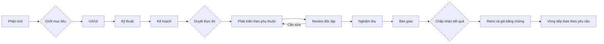

# Quy trình Product Cycle

Phát triển từng phần sản phẩm sử dụng được, truy vết từ yêu cầu tới bàn giao, cải thiện dựa trên bằng chứng.

Mọi công việc có phiên thực hiện và review riêng. Sơ đồ nhấn mạnh review phát triển để dễ đọc. Chủ sản phẩm quyết định các gate; AI tiếp tục trong phạm vi đã chấp nhận.

## Kết quả và truy vết

Quy mô đầu ra phù hợp độ khó. Thay đổi nhỏ có thể có thiết kế ngắn và một kiểm tra tập trung. Vấn đề thay đổi mục tiêu, dữ liệu quan trọng hoặc trải nghiệm phải được ghi nhận, không suy đoán rồi coi là dữ kiện.

Yêu cầu R → thiết kế/kiến trúc → task T → artifact/bằng chứng E → tiêu chí C → quyết định → manifest. Mở lại công việc tạo revision mới, đánh dấu phụ thuộc cần xem lại và giữ các phiên cũ.

## Trạng thái

`pending` → `running` → `reviewing` → `done` hoặc `awaiting_approval`.

Review có thể trả `rework`/`blocked`. `reopen` tạo `stale`. Công việc bị loại khỏi kế hoạch mới là `superseded`, giữ lịch sử. `pause` dừng ở ranh giới công việc; `recover` xử lý phiên gián đoạn khi lock đã được giải phóng.

## Nghiệm thu

Controller kiểm tra cấu trúc, đầu ra, phụ thuộc, hash bằng chứng, exit code lệnh đã duyệt và fingerprint nguồn. Reviewer đánh giá ngữ nghĩa. Chủ sản phẩm quyết định các gate. Một file tồn tại hoặc AI đồng ý không đủ chứng minh hành vi sản phẩm.

Nghiệm thu UI dùng quan sát trình duyệt thật do operator ghi nhận: ảnh, URL, kịch bản, yêu cầu, người quan sát, fingerprint. Codex không tự khai bằng chứng browser. Adapter tự động browser cần được bổ sung và kiểm chứng riêng.

## Cải thiện

Retro giữ quan sát và đề xuất. Cải thiện cần bằng chứng cùng input/expected cho eval. Không tự thay quy trình đang chạy. Phản hồi sau sử dụng được đưa vào brief vòng sau khi có dữ liệu; v0.1 chưa tự theo dõi production.
